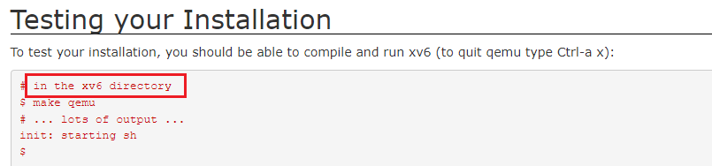

### 1, Building Environment for labs of 6.S081

1) Install Ubuntu 20.04 on WSL or VM. 
    The version must be 20.04. 

​    Check the version of it.

```shell
lsb_release -a
# Notice the codename which should be match version of the mirrors in Aliyun.
No LSB modules are available.
Distributor ID: Ubuntu
Description:    Ubuntu 20.04.6 LTS
Release:        20.04
Codename:       focal
```

2) Change the mirror of `source.list` in Ubuntu to domestic servers in China.

   2.1 Backup `source.list` in `/etc/apt/`

```shell
cp /etc/apt/source.list /etc/apt/source.list.bak
```

   2.2  Replace the mirrors with the following sites.

Notice that the distributed version and the`Codename` of mirrors must be matched your Ubuntu OS.

"ubuntu 20.04 LTS (focal) "

 From  [Aliyun mirrors of Ubuntu](https://developer.aliyun.com/mirror/ubuntu)

2.3 Update `apt`

```shell
sudo apt update
sudo apt upgrade
```

3) Then install tools for the labs follow the instruction of [the official website](https://pdos.csail.mit.edu/6.828/2021/tools.html).

```shell
sudo apt-get install git build-essential gdb-multiarch qemu-system-misc gcc-riscv64-linux-gnu binutils-riscv64-linux-gnu
```

**N.B. The reason that I couldn't install the tools is the Ubuntu official server is not  accessed in China.**

Other: 

If the version of `Qemu` is not suitable for labs, you should uninstall `Qemu`  and install the proper version of it.

```shell
sudo apt-get remove qemu-system-misc
sudo apt-get install qemu-system-misc=1:4.2-3ubuntu6
```

[A guidance from bilibili](./note-images\building env of the labs of 6-S081.txt) (it has not been verified).

### 2, Start Riscv 6

1) Check if all the tools needed are installed.

```shell
riscv64-unknown-elf-gcc --version 
# riscv64-unknown-elf-gcc (GCC) 10.1.0
qemu-system-riscv64 --version
# QEMU emulator version 5.1.0
```

2) Down the git repository of the lab

```shell
git clone git://g.csail.mit.edu/xv6-labs-2020 
# N.B. the repository is "xv6-labs-2020"
cd xv6-labs-2020
# there must be a branch named "util"
checkout until  # switch the the branch name "util"
make qemu
# run the above command in the "until" branch of the repository 
```

3) Note: run `make qemu` at `git://g.csail.mit.edu/xv6-labs-2020 `.The `xv6 directory` is root directory of this repository. This command creates a machine simulator for RSCV XV6. 



3) Note:  You had better set a single core for the CPU of `QEMU`, or the breakpoints will be executed multiple times. 

```shell
make CPUS=1 qemu
```

4) Other commands of `QEMU`

To check the console of `QEMU`. There is nothing displayed in the CLI. You should input like `info mem` to check the memory.  After running the `QEMU`, you can execute the following commands. 

```shell
#Step 1: press Ctrl and a at the same time and release them, then press c.
Ctrl + a, c 
#Step 2
(qemu) info mem # This command can only execute after the preceding command. 
```

**Exit qemu**

```shell
Ctrl + A 
# and then
X
```

N.B. Don't press the three keys at the same time. First press `Ctrl + A`, then release them and press `X`. 

### 3, Explanation of Terminologies

QEMU: It is simulation of hard ware.

### 4, Labs

Before doing any lab read [the guidance](https://pdos.csail.mit.edu/6.828/2021/labs/guidance.html) thoroughly.

Excerpts from the guidance.

> A few pointer common idioms are in particular worth remembering: 
>
> - If `int *p = (int*)100`, then     `(int)p + 1` and `(int)(p + 1)`    are different numbers: the first is `101` but    the second is `104`.    When adding an integer to a pointer, as in the second case,    the integer is implicitly multiplied by the size of the object  the pointer points to.
> - `p[i]` is defined to be the same as `*(p+i)`, referring to the i'th object in the memory pointed to by p. The above rule for addition helps this definition work when the objects are larger than one byte.
> -  `&p[i]` is the same as `(p+i)`, yielding the address of the i'th object in the memory pointed to by p.

#### 0, Preparation and Exercises

[exercieses](./exercises)

The following code is from [pointers](https://pdos.csail.mit.edu/6.828/2019/lec/pointers.c).

```c
#include <stdio.h>
#include <stdlib.h>

void
f(void)
{
    int a[4];
    int *b = malloc(16);
    int *c;
    int i;

    printf("1: a = %p, b = %p, c = %p\n", a, b, c);

    c = a;
    for (i = 0; i < 4; i++)
		a[i] = 100 + i;
    c[0] = 200;
    printf("2: a[0] = %d, a[1] = %d, a[2] = %d, a[3] = %d\n",
	   a[0], a[1], a[2], a[3]);

    c[1] = 300;
    *(c + 2) = 301;
    3[c] = 302;
    printf("3: a[0] = %d, a[1] = %d, a[2] = %d, a[3] = %d\n",
	   a[0], a[1], a[2], a[3]);

    c = c + 1;
    *c = 400;
    printf("4: a[0] = %d, a[1] = %d, a[2] = %d, a[3] = %d\n",
	   a[0], a[1], a[2], a[3]);

    c = (int *) ((char *) c + 1);
    *c = 500;
    printf("5: a[0] = %d, a[1] = %d, a[2] = %d, a[3] = %d\n",
	   a[0], a[1], a[2], a[3]);

    b = (int *) a + 1;
    c = (int *) ((char *) a + 1);
    printf("6: a = %p, b = %p, c = %p\n", a, b, c);
}

int
main(int ac, char **av)
{
    f();
    return 0;
}
```


#### 1, Lab 1

Note: `fork(...)` is in `kernel/proc.c`

##### 1.1) sleep

a. In the root directory of `/xv6-labs-2020/` , switch to the `until` branch.

```shell
git checkout util
```

b. Create the file named `sleep.c` in `user/` and write the code. 

```c
#include "kernel/types.h"
#include "user/user.h"

int main(int argc, char* argv[]) 
{
	// Handling the error of illegal arguments
	if (argc != 2) {
		printf("Only need 2 arguments");
		exit(-1);
	}
	
	// The format of the command: argv = {"name of an instruction", "argv"}
	// An example: argv = {"sleep", "3"}
	int num_of_ticks = atoi(argv[1]);  // cast a string data to an integer.
	// call the system's function 'sleep(...)'.
	sleep(num_of_ticks);
	exit(0);
}
```


c. Add the following code to `Makefile`

`/xv6-labs-2020/Makefile`

```makefile
UPROGS=\
	.....
	$U/_zombie\
	$U/_sleep\
```

d. Run `QEMU` 

```SHELL
make CPUS=1 qemu / make qemu
```

e. Input `sleep 20` to test if the `sleep(...)` is called. If the programme is correct, there will be a pause before the next `$` appears. N.B. one tick clock is not necessarily equivalent to a second. 

```txt
$ sleep 20
nothing happens for a while
$ 
```


##### 1.2) pingpong

**N.B.** The function `fork()` is in `./kernel/proc.c`

