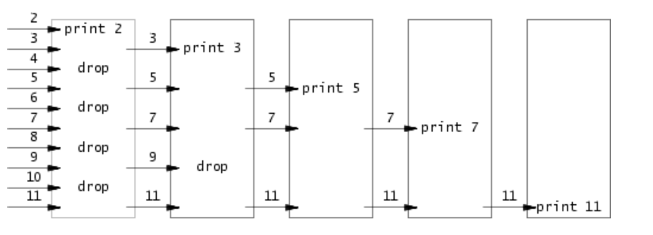

### 1, Building Environment for the labs of 6.S081

#### 1.1 Install 

1) Install Ubuntu 20.04 on WSL or VM. 
    The version must be 20.04. 

​    Check the version of it.

```shell
lsb_release -a
# Notice the codename which should be match version of the mirrors in Aliyun.
No LSB modules are available.
Distributor ID: Ubuntu
Description:    Ubuntu 20.04.6 LTS
Release:        20.04
Codename:       focal
```

2) Change the mirror of `source.list` in Ubuntu to domestic servers in China.

   2.1 Backup `source.list` in `/etc/apt/`

```shell
cp /etc/apt/source.list /etc/apt/source.list.bak
```

   2.2  Replace the mirrors with the following sites.

Notice that the distributed version and the`Codename` of mirrors must be matched your Ubuntu OS.

"ubuntu 20.04 LTS (focal) "

 From  [Aliyun mirrors of Ubuntu](https://developer.aliyun.com/mirror/ubuntu)

2.3 Update `apt`

```shell
sudo apt update
sudo apt upgrade
```

3) Then install tools for the labs follow the instruction of [the official website](https://pdos.csail.mit.edu/6.828/2021/tools.html).

```shell
sudo apt-get install git build-essential gdb-multiarch qemu-system-misc gcc-riscv64-linux-gnu binutils-riscv64-linux-gnu
```

**N.B. The reason that I couldn't install the tools is the Ubuntu official server is not  accessed in China.**

Other: 

If the version of `Qemu` is not suitable for labs, you should uninstall `Qemu`  and install the proper version of it.

```shell
sudo apt-get remove qemu-system-misc
sudo apt-get install qemu-system-misc=1:4.2-3ubuntu6
```

[A guidance from bilibili](./note-images\building env of the labs of 6-S081.txt) (it has not been verified).

#### 1.2 errors

(1) When running `./grade-lab-util  xxx`, there is an error: `/usr/bin/env: ‘python’: No such file or directory`

Solution: 

- Verify if Python is installed by running `python3 --version` in the terminal.

- Locate the Python 3 installation path by running `whereis python3`.

- Create a symbolic link to map `python` to `python3` using the command: 

- `sudo ln -s /usr/bin/python3 /usr/bin/python`.

### 2, Start  and quit xv6

#### Starting xv6 in normal mode

1) Check if all the tools needed are installed.

```shell
riscv64-unknown-elf-gcc --version 
# riscv64-unknown-elf-gcc (GCC) 10.1.0
qemu-system-riscv64 --version
# QEMU emulator version 5.1.0
```

2) Down the git repository of the lab

```shell
git clone git://g.csail.mit.edu/xv6-labs-2020 
# N.B. the repository is "xv6-labs-2020"
cd xv6-labs-2020
# there must be a branch named "util"
checkout until  # switch the the branch name "util"
make qemu
# run the above command in the "until" branch of the repository 
```

3) Note: run `make qemu` at `git://g.csail.mit.edu/xv6-labs-2020 `.The `xv6 directory` is root directory of this repository. This command creates a machine simulator for RSCV XV6. 


3) Note:  You had better set a single core for the CPU of `QEMU`, or the breakpoints will be executed multiple times. 

```shell
make CPUS=1 qemu
```

4) Other commands of `QEMU`

To check the console of `QEMU`. There is nothing displayed in the CLI. You should input like `info mem` to check the memory.  After running the `QEMU`, you can execute the following commands. 

```shell
#Step 1: press Ctrl and 'A' at the same time and release them, then press 'C'.
Ctrl + A, C 
#Step 2
(qemu) info mem # This command can only execute after the preceding command. 
```

**Exit xv6 of the qemu type**

```shell
Ctrl + A 
# and then
X
```

N.B. Don't press the three keys at the same time. First press `Ctrl + A`, then release them and press `X`. 

#### Starting xv6 in debugging mode

Start the xv6 in debugging mode so that we can monitor how this operating system starts from the first instruction. (in Ubuntu 20.04)

1. First of all, start `xv6` with gdb mode in the root of the lab.

   ```shell
   make CPUS=1 qemu-gdb
   ```

   There are outputs to show us the tcp:xxxx port and instruct us to open a new window.

2. Then open a new window, in the same directory run multiarch

   ```shell
   gdb-multiarch
   ```

3. In the gdb, load the kernel file and connect the qemu.

   ```shell
   (gdb)file kernel/kernel
   (gdb)target remote localhost:25000   # The port number is in the first console. 
   ```

4. Start debugging.

   ```shell
   (gdb)break _entry  # set a breakpoint at the "_entry". See "kernel/kernel.asm"
   (gdb)layout split  # Show splited windows to monitor the source file and instructions
   (gdb)c			   # Continue. Don't enter "start" becasue qemu has already started.
   (gdb)next 		   # Then we can use next, step and so forth to debug. 
   (gdb)nexti
   ```

   

### 3, Miscellaneous

**Terminology: **

QEMU: It is simulation of hard ware.

**How to grade ?** 

```shell
make grade	# Run all tests.
# Run a grade test for one assignment. 
./grade-lab-util sleep	
# or
make GRADEFLAGS=sleep grade
```


### 4, Labs

Before doing any lab read [the guidance](https://pdos.csail.mit.edu/6.828/2021/labs/guidance.html) thoroughly.

Excerpts from the guidance.

> A few pointer common idioms are in particular worth remembering: 
>
> - If `int *p = (int*)100`, then     `(int)p + 1` and `(int)(p + 1)`    are different numbers: the first is `101` but    the second is `104`.    When adding an integer to a pointer, as in the second case,    the integer is implicitly multiplied by the size of the object  the pointer points to.
> - `p[i]` is defined to be the same as `*(p+i)`, referring to the i'th object in the memory pointed to by p. The above rule for addition helps this definition work when the objects are larger than one byte.
> -  `&p[i]` is the same as `(p+i)`, yielding the address of the i'th object in the memory pointed to by p.

#### 0, Preparation and Exercises

[exercieses](./exercises)

The following code is from [pointers](https://pdos.csail.mit.edu/6.828/2019/lec/pointers.c).

```c
#include <stdio.h>
#include <stdlib.h>

void
f(void)
{
    int a[4];
    int *b = malloc(16);
    int *c;
    int i;

    printf("1: a = %p, b = %p, c = %p\n", a, b, c);

    c = a;
    for (i = 0; i < 4; i++)
		a[i] = 100 + i;
    c[0] = 200;
    printf("2: a[0] = %d, a[1] = %d, a[2] = %d, a[3] = %d\n",
	   a[0], a[1], a[2], a[3]);

    c[1] = 300;
    *(c + 2) = 301;
    3[c] = 302;
    printf("3: a[0] = %d, a[1] = %d, a[2] = %d, a[3] = %d\n",
	   a[0], a[1], a[2], a[3]);

    c = c + 1;
    *c = 400;
    printf("4: a[0] = %d, a[1] = %d, a[2] = %d, a[3] = %d\n",
	   a[0], a[1], a[2], a[3]);

    c = (int *) ((char *) c + 1);
    *c = 500;
    printf("5: a[0] = %d, a[1] = %d, a[2] = %d, a[3] = %d\n",
	   a[0], a[1], a[2], a[3]);

    b = (int *) a + 1;
    c = (int *) ((char *) a + 1);
    printf("6: a = %p, b = %p, c = %p\n", a, b, c);
}

int
main(int ac, char **av)
{
    f();
    return 0;
}
```

#### 0, Tips of Labs

(1) We can use `printf()` to print out integers as same as in C.

```c
// The main function in pingpong.c
int main(){
    int m = 2;
    printf("test %d\n", m);
}
```

(2) In the root directory of `/xv6-labs-2020/` , switch to the `until` branch.

```shell
git checkout util
```

(3) There is no `ps` command in xv6, but we can use `Ctrl + P` instead. 

#### 1, Lab 1

Note: `fork(...)` is in `kernel/proc.c`

##### 1.1) sleep

a. Create the file named `sleep.c` in `user/` and write the code. 

```c
#include "kernel/types.h"
#include "user/user.h"

int main(int argc, char* argv[]) 
{
	// Handling the error of illegal arguments
	if (argc != 2) {
		printf("");
		exit(-1);
	}
	
	// The format of the command: argv = {"name of an instruction", "argv"}
	// An example: argv = {"sleep", "3"}
	int num_of_ticks = atoi(argv[1]);  // cast a string to an integer.
	// call the system's function 'sleep(...)'.
	sleep(num_of_ticks);
	exit(0);
}
```


b. Add the following code to `Makefile`

`/xv6-labs-2020/Makefile`

```makefile
UPROGS=\
	.....
	$U/_zombie\
	$U/_sleep\
```

c. Run `QEMU` 

```SHELL
make CPUS=1 qemu / make qemu
```

d. Input `sleep 20` to test if the `sleep(...)` is called. If the programme is correct, there will be a pause before the next `$` appears. N.B. one tick clock is not necessarily equivalent to a second. 

```txt
$ sleep 20
nothing happens for a while
$ 
```


##### 1.2) pingpong

> Write a program that uses UNIX system calls to ''ping-pong'' a  byte between two processes over a pair of pipes, one for each  direction.  The parent should send a byte to the child;  the child should print "<pid>: received ping",  where <pid> is its process ID,  write the byte on the pipe to the parent,  and exit;  the parent should read the byte from the child,  print "<pid>: received pong",  and exit.  Your  solution should be in the file `user/pingpong.c`.  

Some hints:  

- Use `pipe` to create a pipe.    
- Use `fork` to create a child.    
- Use `read` to read from the pipe, and `write` to write to the pipe.    
- Use `getpid` to find the process ID of the calling process.    
- Add the program to `UPROGS` in Makefile.    
- User programs on xv6 have a limited set of library functions available to them. You can see the list in    `user/user.h`; the source (other than for system calls)    is in `user/ulib.c`, `user/printf.c`,    and `user/umalloc.c`.  

(1) It asks us to create a pair of pipes, namely two pipes to communicate between a parent process and its child process. One pipe is used for a parent to write and its child to read and the other is used for the child to write back the byte and the parent to read. We can refer to `pipe2.c` in the examples of Lecture 1 to know how to implement pipes connecting two process. 

(2) Don't forget to write `wait(0)` in the parent process to wait for its child to input a byte to a pipe and to `exit(0)`. Or the parent will execute the `if(...)` statement simultaneously when its child hasn't written any bytes into a pipe yet.  

**N.B.** `wait(...)` waits for only one child process, namely the parent will wait for only one child to exit when the function is called. If the parent have many child process, it won't wait for others. 

A solution is as follows.

```c
#include "kernel/types.h"
#include "user/user.h"

int main(int argc, char *argv[])
{
	int pid;
	int fds[2];
	int fds_b[2];
	char buff[2];

	// Note that a pair of pipes should be called outside the following
	// "if...else" because they are shared by a child process and its parent. 
	pipe(fds);
	pipe(fds_b);

	pid = fork();
	// After the above "fork()", there are two process executing the following code.

	// The parent process.
	if (pid > 0) {

		write(fds[1], "A", 1);

		// (1) Wait for a child process to exit.
		// If a parent process doesn't wait, the following code will be run simultaneously, 
		// therefore, it might not receive the message "B" from its child process. 
		// (2) Whereas, reading from a pipe holds the parent process if the child process doesn't
		// exit.
		wait(0);
		
		read(fds_b[0], buff, 1);  // (2) read from a pipe.
		if (buff[0] == 'B') {
				// Get the parent process ID.
				pid = getpid();
				printf("%d: received pong\n", pid);
		}
		exit(0);

	} else if (pid == 0) {
		// A child process reads a byte from a pipe and stores the data to "buff".
		read(fds[0], buff, 1);

		if (buff[0] == 'A') {

			// If a child received "A" from its parent, it writes the "A" 
			// into its file descriptor. Since the default output of a process 
			// is a console, so the "A" will be printed on the CLI.
			//write(1, buff, 1); // To test if the 'A' is output.

			// Get the child process ID.
			pid = getpid();
			printf("%d: received ping\n", pid);

			// The child should write something such as "B" back the a pipe so that its parent can
			// read from the pipe.
			write(fds_b[1], "B", 1);
			exit(0);
		}

		exit(1);

	} else {
		exit(-1);
		printf("fork error!");
	}
	
	exit(0);

}
```

##### 1.3) primes

Some hints:  

- It's simplest to directly write 32-bit (4-byte) `int`s to the pipes, rather than using formatted ASCII I/O.     

***Elaboration of Some Hints:***

What is "formatted ASCII I/O"?

It refers to the characters in the ASCII table, while "32-bit (4-byte) `int`s" means the decimal or hexadecimal value represented by 4-byte integers. It is `int write(int, const void *, int)`, so the second argument can be a pointer of integer. 

**How to do the prime lab?**

```c
// The pseudo-code
p = get a number from left neighbor
print p
loop:
    n = get a number from left neighbor
    if (p does not divide n)
        send n to right neighbor
```



1) First of all, read [this report](https://swtch.com/~rsc/thread/) on Doug McIlroy's s sieve and [Eratosthenes Sieves](https://en.wikipedia.org/wiki/Sieve_of_Eratosthenes). 

2) From the pseudo code and the picture we can infer that there is a process feeding numbers from 2 to 35 to a pipe; presumably, this process is the parent. Then a child process reads and sieves. 

3) When the child process read the first number, `p = 2`, it should print it. 

Then this child reads the next number, `n = 3`, from the left labour(its parent) and let 2 divide 3. Since 3 is not a multiple of 2, feed 3 to the right neighbour(the grandchild process). 

And then read the next number: `n = 4`, which is a multiple of 2. and drop it. 

Keep on.  Read the next 5 and it is not a multiple of 2, feed it to the right neighbour(the same grandchild process which receives `3`). 

4) In the second child process, when it receives the first number: 3, it should print it since there are not any other numbers to divide. 

It won't receive 4, because it is dropped in the previous child process. 

When it receives 5, print it because it is not a multiple of 3. 

When it receives 6, drop it because it is a multiple of 3. 

We have already known the rule now. Move on. 

**Code of `primes.c`**

The first edition, which is not correct although it prints all the primes. It uses while loop instead of recursively creating child process to implement. Furthermore, neither parent nor child process closes pipe properly. 

```c
#include "kernel/types.h"
#include "user/user.h"

#define N 34
#define SIZE_INT 4	// size of int


// Wrong impletation.
int loop_proc(int p[]) 
{

	int m, k, pid;

	read(p[0], &m, sizeof(int));
	printf("pid %d --> %d\n", getpid(), m);
	while (read(p[0], &k, sizeof(int))) {
		// Drop multiples of m.
		if (k % m == 0)
			continue;
		// Feed numbers to the right neighbour.
		int p2[2];
		pipe(p2);
		pid = fork();
		// The child is the parent of the newly created grandchild process.
		if (pid > 0) {
			// Write non-multiplied numbers to the right neighbour.
			write(p2[1], &k, SIZE_INT);
		} else if (pid == 0) {
			// The grandchild process.
			read(p2[0], &m, SIZE_INT);
			printf("pid %d --> %d\n", getpid(), m);
		}

	}
	return 0;
}
```

Correct code: 

1) Note that after `fork`, both parent and child have file descriptors referencing the pipe. Namely, the read end has two references from the parent and the child, so is the write end. Since the parent doesn't need the read end, it should close it: `close(p[0])`. Similarly, the child should  close the write end:`close(p[1])`

```c
pipe(p);
// Create a child process.
// After forking, child copies the file descriptor table from the parent, includin pipes.
pid = fork();  
```

2) The while loop which constantly writes integers to a pipe should be in the new parent process. Calling the recursive `sieve(..)` is in the new child process.  **In fact, this `sieve()` creates a long pipeline of multiple pipes created in each call.** 

```c
void sieve(int fds[])
{
	// close the write end of a pipe in a child.
	// The reason both child and parent have file descriptors refering to the pipe, 
	// therefore, we must close the write end both in parent and child so that the 
	// read end won't block. 
	close(fds[1]);

	int prime, np[2], next, pid;
	// Read the first "p": prime.
	int count = read(fds[0], &prime, SIZE_INT);
	if (count == 0)
		exit(0);
	printf("pid %d --> %d\n", getpid(), prime);
	
	// Create another pipe.
	pipe(np);
    // The current child should creat grandchild to feed numbers.
	pid = fork();
	if (pid > 0) {
		// The current child is a new parent prcess.
		// Close the read end at the write side.
		close(np[0]);
		// Keep on writing numbers to the write end.
		while (read(fds[0], &next, SIZE_INT)) {
			// Drop multiples of the first prime.
			if (next % prime == 0)
				continue;
			write(np[1], &next, SIZE_INT);
		}
		// After reading "fds", close it.
		close(fds[0]);
		// Close the write end after the while loop; Wrinting to a pipe is finished. 
		close(np[1]);
		wait(0);
	} else if (pid == 0) {
		// Newly created child process.
		close(np[1]);
		sieve(np);
	}
	
	// Actually, all of the processes are connected by pipes with the recursive "sieve".

	exit(0);

}

int main(int argc, char *argv[])
{
	int n, pid;

	int p[2];
	// Create a pipe.
	pipe(p);

	// Create a child process.
	pid = fork();

	// The parent process.
	if (pid > 0) {
		// Close the read end of a pipe since parent only needs to write. 
		close(p[0]);

		for (n = 2; n < 35; n++) {
			write(p[1], &n,  sizeof(int));
		}
		// When writing ends in the for loop, close the write end so that the read end won't block.
		close(p[1]);

		wait(0);

	} else if (pid == 0) {
	// A child process.

		// Wrong!
		//loop_proc(p);
        
		// Correct one
        sieve(p);
		exit(0);
	} else {
		fprintf(2, "fork error!");
	}
	exit(0);
}
```


##### 1.4) find

**The Question**

Write a simple version of the UNIX find program: find all the files  in a directory tree with a specific name.  Your solution  should be in the file `user/find.c`.   

Some hints:  

- Look at `user/ls.c` to see how to read directories.    
- Use recursion to allow find to descend into sub-directories.    
- Don't recurse into "." and "..".    
- Changes to the file system persist across runs of qemu; to get a clean file system run `make clean` and then `make qemu`.    
- You'll need to use C strings. Have a look at K&R (the C book), for example Section 5.5.    
-  Note that == does not compare strings like in Python. Use strcmp() instead.    
- Add the program to `UPROGS` in Makefile.  

**Let's analyse.** 

(1) A function named `stat(...)` is in `user/ulib.c` and `strcmp(...)` for comparing strings is also in it.

(2) N.B. the return value of `strcmp(...)` is not 0 when two strings are not identical, therefore, if we make it the condition of a `if(...)` we should add ``!` to `if(!strcmp(...))` to converse it 1 which indicates true. 

(3) `read(fd, &de, sizeof(de))` also reads `.` and `..` in in a directory. So that

(4) **N.B. It is to find all the files with a specific name, not directories.** Sadly, I hadn't read the question thoroughly so that I wasted much time on searching for both directories and files. Whereas, I realised that I was wrong and modified the code.  Finally, I finished this laboratory.

`user/ls.c`    (I added some extra comments to the original code. )

```c
#include "kernel/types.h"
#include "kernel/stat.h"
#include "user/user.h"
#include "kernel/fs.h"
#include "kernel/fcntl.h"

char*
fmtname(char *path)
{
  // "DIRSIZ" is used to align the names of files and directories.
  static char buf[DIRSIZ+1];  
  char *p;

  // Find first character after last slash. 
  // It abstracts the last name of a file of a path, for examle, "foo" from "/user/foo".
  for(p=path+strlen(path); p >= path && *p != '/'; p--)
    ;
  p++;

  // Return blank-padded name.
  if(strlen(p) >= DIRSIZ)
    return p;
  // Move content in a place to another in memory. See 'user/user.h.' and 'user/ulib.c'.
  // "buf" is the destination.
  memmove(buf, p, strlen(p));  
  // Set the unused space in "buf" to ' '. See 'user/ulib.c'.
  memset(buf+strlen(p), ' ', DIRSIZ-strlen(p)); 
  return buf;
}

void
ls(char *path)
{
  char buf[512], *p;
  int fd;
  struct dirent de;
  struct stat st;
    
  // "fd" has already been assigned the return value because the code in 
  // the condition of "if(condition)" has been executed, even though the code of the 
  // statement of the following "if..." is not executed. So "fd" can be used by the 
  // rest code of this function. 
  if((fd = open(path, O_RDONLY)) < 0){
    fprintf(2, "ls: cannot open %s\n", path);
    return;
  }
  // "fstat(...)" is a system call. 
  if(fstat(fd, &st) < 0){
    fprintf(2, "ls: cannot stat %s\n", path);
    close(fd);
    return;
  }

  switch(st.type){
  case T_FILE:
    printf("%s %d %d %d\n", fmtname(path), st.type, st.ino, (int) st.size);
    break;
          
  // The code in the "case" below reads directories. 
  case T_DIR:  
    if(strlen(path) + 1 + DIRSIZ + 1 > sizeof buf){
      printf("ls: path too long\n");
      break;
    }
    strcpy(buf, path);
          
    // Copy the value of pointer in "buf" to "p".
    // Move the char pointer to the end of the name of the path.
    p = buf+strlen(buf); 
    // Then add a forward slash '/' after the name and now "p" deferences 
    // the byte after '/'.
    *p++ = '/'; 
          
    /*
    * When reading a directory, it is a "while loop", therefore, a process will read all
    * the files in this directory one by one, therefore, the "while" is being executed 
    * as many as the number of files, if the condition is true.
    */
    while(read(fd, &de, sizeof(de)) == sizeof(de)){
      if(de.inum == 0)
        continue;
        
      /*
      * The `memmove(...)` function assigns the name of a file to "p" so that the return
      * value of "fmtname(buf)" has the same name, therefore, "p" and "buf" are pointers 
      * deferencing the same place. I have verified that by printing the "buf" before and 
      * after it and running 'qemu' again. */ 
      printf("buff before move: %s\n", fmtname(buf)); // Verifying code added by me.
      memmove(p, de.name, DIRSIZ);
      p[DIRSIZ] = 0;   // 0 is "NULL" indicating the end of a string.
      printf("buff after move: %s\n", fmtname(buf)); // Verifying code added by me.
      
   
      if(stat(buf, &st) < 0){
        printf("ls: cannot stat %s\n", buf);
        continue;
      }
      // Note that "buf" is the full name of the path. 
      printf("%s %d %d %d\n", fmtname(buf), st.type, st.ino, (int) st.size);
    }
    break;
  }
  close(fd);
}

int
main(int argc, char *argv[])
{
  int i;

  if(argc < 2){
    ls(".");
    exit(0);
  }
  for(i=1; i<argc; i++)
    ls(argv[i]);
  exit(0);
}

```

There is a bug in my solution of "find" , which is when the program recurse to a directory and find a file it can't find another file in current directory following this directory. As an illustration, if the list of current directory is:

```shell
...
a  1   # "1" indicates it is a dir. It is a directory with a file name b in it: a/b
b  2   # "2" indicates it is a file.
$ find . b
./a/b  # Only b in a can be found.
```

The reason is that all the recursive functions are in one process. Whereas, I wrote `exit(...)` in the `find(...)`, which terminates the current process when the program recurses into a new `find(...)` and find one file with the specific name.  

```c
int find(char *path, char *file_name)
{	
    // .....
	/*
	 * exit(...) should not be written here because it will ternimate the current
     * process so that the following directories or file will NOT be read. 
	 */ 
	// exit(0);

	close(fd);
	return 0;
}
```

##### 1.5 ) xargs

Note: 

1. The command in the example is `echo hello too | xargs echo bye`. How can `xargs` read the input from the previous `echo`? 

   It is easy to read the input from it. Just read from the standard input. If there is a pipeline, `xargs` will read from it; if there isn't the standard input is the console. Hence, if we enter `xargs echo bye` only, the console will wait for input from user. 

   ```c
   char buf[215];
   if (pid > 0) {
       read(0, buf, sizeof buf);
   }
   ```

2. In `xargs echo bye`, `echo bye` are from `*argv[]`. 

3. A char array `char buf[]` is an element of  `*argv[]`, therefore, it can be added at the end of `*argv[]`. 

How to do the lab ? 

1. After working for a long time, my `xargs` can read standard input from `echo hello too`  and read `echo bye` from `*argv[]`. Whereas, I don't know how to remove the `echo` from the `*argv[]` or add `hell too` after  `bye`.

**There are bugs in my solution:** 

```c
// My first solution has bugs. 
#include "kernel/types.h"
#include "kernel/stat.h"
#include "user/user.h"
#include "kernel/fs.h"

#define MAXARG 16 

int main(int argc, char *argv[])
{
	if (argc < 2) {
		fprintf(2, "Input at least one argument.\n");
		exit(2);
	
	} else if (argc > MAXARG) {
		fprintf(2, "Too many arguments. Input no more than 15.\n");
	}


	char buf[32];
	char *argv2[MAXARG];

	int pid = fork();

	if (pid > 0) {
		// The parent process:
		wait((int *)0);
	} else if (pid == 0) {
		
        read(0, buf, sizeof buf);
		int i = 0;
		while ((argv2[i] = argv[i]) != 0)
			++i;	

		argv2[i++] = buf;
		argv2[i] = '\0'; 

		printf("argv2 %s\n", argv2[1]);

		exec(argv2[1], argv2 + 1);
		// One child process exits. 
		exit(0);
	}
	exit(0);
}
```

**What are the bugs?** 

There are multiple bugs in  the above code.

1. If I enter `echo hello too | xargs echo bye`, it can output `bye hello too` properly. Whereas, if I type `xargs echo bye`, the program waits standard input so I have to terminate the input by pressing `Ctrl + D` to add `EOF` manually. Apparently, it is not a correct solution. 

   However, when I tested the `xargs` in Unix, it also waits for input. It it not a bug, but my code has other bugs. 

2. It asks us to individual lines of input, but I didn't deal with `\n` and to use `fork` and `exec` to invoke the command for each line of input. Sadly, I read the hints but I didn't understand until I wrote buggy code. 

3. The program doesn't read input characters one by one as it is said in the "hints". 

4. 

**Why does the program wait for input for a pipeline or standard input?**

The reason is that `read(...)` is a blocking call so it will wait infinitely until it receive something. 

**After debugging**

The following is much better than the previous one, but it it not perfect. 

```c
int main(int argc, char *argv[])
{
	if (argc < 2) {
		fprintf(2, "Input at least one argument.\n");
		exit(2);
	
	} else if (argc > MAXARG) {
		fprintf(2, "Too many arguments. Input no more than 15.\n");
	}


	char buf[32];
	char *argv2[MAXARG];


		// Combine standard input and arguments.
		int i, j;  // Don't copy the argv[0], which is "xargs" itself.
		for (i = 0, j = 1; j < argc; j++, i++) {
			argv2[i] = argv[j];
		}
	
	// Read from standard input, such as from  a pipeline in `echo hello | xargs echo bye`. 
	// From the hints, we know that this progrm should read a character each time until
	// it encounters '\n'.

	char c;
	int k = 0;
	while (read(0, &c, sizeof c) > 0) {	// "read()" returns the length it reads from standard input, including the last '\0'.
		if (c == '\n') {
			buf[k++] = c;

			argv2[i] = buf;
			// "Use fork and exec to invoke a comand on each line of input." from hints
			int pid = fork();
			if (pid == 0) {
				exec(argv2[0], argv2);
				printf("exec failed");
				exit(0);
			} else if (pid > 0) {
				wait(0);
			} else {
				printf("fork error!");
			}

		} else {
			buf[k++] = c;		
		}
	}

	exit(0);

}
```

