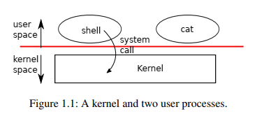
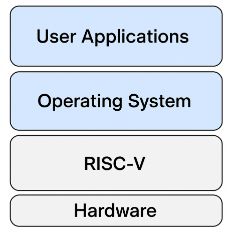

## 6.S081 

The Objectives of 6.S081

1. Will extend a simple OS named XV6. Labs are designed for students to write some functions to extend the XV6. For example, in the first lab we should write a sleep function to let the OS fall asleep. 
2. 

### 0, Learning Tips

1. Learning pointers in C.
2. Read the [guidance](https://pdos.csail.mit.edu/6.828/2021/labs/guidance.html) before you do any lab.
3. [Schedule](https://pdos.csail.mit.edu/6.828/2021/schedule.html)
4. The textbook should be read along with [the source code of xv6](https://github.com/mit-pdos/xv6-riscv).
5. "&c" means "etc" or "et cetera".

### 1, What are operating systems? 

##### 1.1 Operating Systems

An operating system is kind of a collection of some basic functions which can share hardware among applications-which are that we, common users, actually use. 

Typically, there are two different spaces in a operating system. See Figure 1.1. Software 



##### 1.2 What is a kernel?

A kernel is a special programme which provides services to run programmes in user space. 

Normally, an operating system has only one kernel but has many process. 


##### 1.3 What are system calls?

System calls are interfaces offered by the kernel of an operating system for applications in user space.

When a process needs to invoke a kernel service, it actually invokes a system call. When a system call are being called, they jump into the kernel to execute. The kernel retrieves the arguments in the system call and do its job. The process alternates between user space and kernel space. 

Note that system calls are written in C so that they look like function calls, but they are not. 

##### 1.4 What is RISC-V?

RISC-V, which is an acronym of Reduced Instruction Set Computer-Five,  is an open-source instruction set architecture. 



### 2, Purposes of Operating Systems

**What the purposes for which these operating systems are made for?**

- Abstraction of hardware
- Multiply these hardware
  It offers a platform on which many applications such as text editors,  web browsers, and so forth could run at the same time, or likely at the same time.
- Isolated different applications when one of them breaks down others are not affected.
- Sharing data among applications. 
  For instance, we can transfer out file via email on a web browser. 
- Securing the users' data.
- Performance
  To help applications such as games perform well, especially when you have bought rather expensive hardware.
- Other usage in a wide range.


## Notes of Chapters

### Chapter 1 

#### Processes and memory

##### Process

**(1) What is a Process?** 

Each running programme, which is called a process, has memory containing **instructions, data and a stack.**  

1. **The instructions** implement the programme's computation. For instance, the assembly code which is generated by a compiler from a C programme is the abstraction of instructions in machine level.
2. **The data** are the variables on which the computation acts. 
3. **The stack** frame is used to support procedure calls. The machine uses the stack to pass arguments, to store return information, to save registers for later restoration, and for local usage. 

Each application in user space is a process and have a unique process identifier(PID). A process is prepared for running a programme.

The kernel of an OS manages processes. 

**(2) Why does a process create a new process by using the `fork()`?**

The original process and the new process are called *parent* and *child*, respectively.

[Here is an answer for Stack Overflow.](https://stackoverflow.com/questions/8292217/why-fork-works-the-way-it-does)

As an illustration, when the *shell* is running, a user input `echo foo` in the CLI. If *shell*  calls `exec()` directly to execute `echo`, the current *shell* will be replaced by the echo and it is killed, so there won't be any CLI any more. 

##### PID

**Why are the value of PID in a child process and its parent process different?**

The child has its own unique PID, but not 0; `fork()` returns both in a new child process and its parent process. In the new process(child process), `fork()` returns 0. Whereas, `fork()` returns the real PID of a child in its parent process. **N.B.** that the PID is 0  which is returned from `fork()` doesn't mean that its real PID is 0 but it is just a return value from a `fork()` in a child process. 

Note, as aforementioned,  `fork()` returns both in the original and new processes.  

```c
int pid = fork();
if(pid > 0){
    printf("parent: child=%d\n", pid);
    pid = wait((int *) 0);
    printf("child %d is done\n", pid);
} else if(pid == 0){
    // When pid is 0, it is in a child process.
    printf("child: exiting\n");
    exit(0);
} else {
	printf("fork error\n");
}
```

##### wait

If a parent have multiple child processes, one `wait(...)` only waits for one of them. In order to wait all child processes, a parent process must have the same number of `wait(...)` .

#### I/O and File Descriptors

##### What are file descriptors?

*From the textbook of 6.S081:*

A file descriptor is a small integer represent a kernel-managed object that a process may read from or write to. Attention should be paid here is that the object is not only normal files but also is a directory, a device or a pipe; they are all represented by file descriptors. The reason why we refer to all of them with descriptors is that it abstracts away from the difference between files, devices, and devices so that their interfaces are uniformed. In fact, all the data are bytes wherever it is from to a file, a device or a pipe; commands are represented by bytes. Reading and write bytes from and to file descriptors are applicable to all of them. 

In Unix-like operating systems, such as RISC, a process reads from file descriptor 0(input), writes to file descriptor 1(output), and writes error messages to file descriptor 2. The file descriptor interface is an abstraction of files, pipes and devices. 

[An answer from StackOverflow.](https://stackoverflow.com/questions/5256599/what-are-file-descriptors-explained-in-simple-terms)

**N.B.** Operating systems set the same name of file descriptors in different processes. As an illustration, there are several file descriptors with the name of 0,  but they are different files and isolated in different processes.

##### How a process obtain a file descriptor?

A process can obtain a file descriptor by opening a file, directory, device, creating a pipe or just duplicating an existing file descriptor(`dup(int fd)`).

##### Notes of I/O and File Descriptors

- Child process will keep the file descriptor table of its parents. The system call `exec(...)` replaces the calling process(the caller's) memory but preserves it file table. 

- There is a file descriptor table maintained by a kernel in each process. File descriptors and their mapping addresses are stored in the table. Perhaps there is an array `int fd[3]` which represents a file descriptor with its indices, 0, 1 and 2, as read, write and error file. (I guess and it is to be verified.)

- Although `fork()` copies the file descriptor table, the offset is shared between parent and child  when reading  from or writing to a file. 

  ```c
   else {  // A parent process.
      wait(0);
      write(1, "world\n", 6);
  }
  ```
  
  The final output is "Hello world", which indicates that a parent process and its child write into a same file (because they share the same file descriptor table) and the same offset. 
  

It is the same with a system call named `dup(...)`. 

- Note that `write(...)` outputs to a Console(CLI) by default in a process. 

  ```c
  int main(int argc, char *argv[]) 
  {
      if(fork() == 0) { 
          write(1, "hello ", 6);  // Output "hello" on CLI. 
          exit(0);  
      }
  }
  ```

  

- **What is I/O redirection?**

  When a command is executed, such as `cat`, the output of it is normally on the terminal(CLI). Whereas, if we output to a file named `redir.text` ,  it is I/O redirection and we can use `cat > redir.txt` to redirect the output to `redir.txt`. A process of `cat` will use system calls such as`open(), dup(), close(), pipe()` to implement the I/O redirection. `open()` will open a file `redir.txt` and return its file descriptor to the process.

  That's why `fork()` and `exec()` are separate calls; between them, the child's I/O can be redirected without interrupting the main process.

  *Examples:*

  ```shell
  cat < input.txt  # redirect input 
  cat > output.txt # redirect output
  cat 2> error.txt # redirect error to error.txt
  # redirect standard output and error to out_and_error.txt
  cat foo.txt > out_and_error.log 2>&1 
  ```

  An example of redirection in the textbook of 6.S081

  ```c
  #include "kernel/types.h"
  #include "user/user.h"
  #include "kernel/fcntl.h"
  
  // redirect.c: run a command with output redirected=
  int main()
  {
    int pid;
    pid = fork();
    if(pid == 0){
      // In child process, the default output(terminal) which is represented by file
      //descriptor 1, is closed.
      close(1); 
        
      // Open "output.txt" and "O_WRONLY|O_CREATE" indicates it is written only if 
      // the file doesn't exist then create one. 
      // By convention, since file descriptor 1 has been closed previously, open(...)
      // will return the smallest available file descriptor, namely this 1. and assign
      // it to "output.txt" instead of a terminal. 
      // There is no need to receive the return value explicitly since there are only
      // 0,1,and 2 descriptors in a process. This child process will write to file
      // descriptor 1 by default. 
      open("output.txt", O_WRONLY|O_CREATE); 
  
      char *argv[] = { "echo", "this", "is", "redirected", "echo", 0 };
      exec("echo", argv);
      printf("exec failed!\n");
      exit(1);
    } else {
      wait((int *) 0);
    }
  
  exit(0);
  }
  ```
  

##### Others 

- `copy(...)` doesn't care about the format of data. Whatever data is, it is just a sequence of byte in a computer system.

#### Pipe

##### Notes of pipe

- What is a pipe in an operating system?

  Pipe is a small kernel buffer exposed to two or more processes; it is used for the communication of these processes. As an illustration, `ls foo | grep test` creates a pipe between `ls` and `grep`. 

  Note that a pipe is a file descriptor, too. In `int fds[2]; int pipe(fds);` the function `pipe(p)`  creates a new pipe and put another file descriptors, namely read and write, into the pipe.

- What are pipes used for?

  Processes communicate through pipes. 

- In the textbook, why would the `wc`(word count)  never stop when the file descriptors referring to the write end of a pipe open?

  The `read` on the read side of pipe will wait for new input if the `write` end of a pipe is open; the `read` will return 0 indicating the termination of a process when the `write` end close. Apparently, it is important for a child process to close the write end before executing `wc`.

- Pipes have [four advantages](.\note-images\four-advantages-of-pipes.md) over temporary files. As an illustration, in shell, pipes are better than temporary files. 

  1. First, pipes automatically clean themselves up. Whereas, "shell" should carefully remove the temporary files.

  2. Second, pipes can pass relentless streams of data since a process read from one end and another process process write in the other end. The size of data is infinite. In contrast, shell should allocate a file in a disk with limited size. 

  3. Pipes allow one process read from one end and another process write to the other end simultaneously in a pipeline, while a process can't access a file until another process has finished. 

  4. Pipes support blocking reads and writes.

     When a process is reading from a pipe and there is no more data being written into the pipe, the reading process will block(wait) if the write end is not closed; no data will be lost. Similarly, if a process is writing into a pipe which has no more space because the reading process is not able to read quickly, the writing process will also block(wait). 

     For a temporary file, since multiple processes can access it synchronously, blocking reads and writes should be handle manually by synchronous code in programmes, which is not as efficient as pipes in a operating systems.

     

##### [Examples of pipes](https://pdos.csail.mit.edu/6.828/2021/lec/l-overview/pipe1.c)

```c
// pipe1.c: communication over a pipe

#include "kernel/types.h"
#include "user/user.h"
int main()
{
  // "fds" stands for "File descriptors". (comments by me)
  int fds[2];  
  char buf[100];
  int n;

  // create a pipe, with two FDs in fds[0], fds[1].
  pipe(fds);
  
  write(fds[1], "this is pipe1\n", 14);
  n = read(fds[0], buf, sizeof(buf));

  write(1, buf, n);

  exit(0);
}
```

```c
#include "kernel/types.h"
#include "user/user.h"

// pipe2.c: communication between two processes

int
main()
{
  int n, pid;
  int fds[2];
  char buf[100];
  
  // create a pipe, with two FDs in fds[0], fds[1].
  pipe(fds);

  pid = fork();
  
  if (pid == 0) {
    // "pid==0" indicates that it is a child process. 
    // A child process is now writing "this is pipe2\n" into the write end of a pipe.
    write(fds[1], "this is pipe2\n", 14); // There are 14 characters in total.
  } else {
    // Here is a parent process. 
    // 1. Read from the pipe, namely from fds[0]; store the data into "buf".
    n = read(fds[0], buf, sizeof(buf)); 
    // 2. Then, write the data in "buf" to the file descriptor of parent process itself. 
    write(1, buf, n);  
  }

  exit(0);
}
```

##### Pipeline

What is a pipeline?

A pipeline is a combination of multiple processes which communicate by pipes. As an illustration,  `grep fork sh.c | wc -l`  is a pipeline. 

How shell implements pipelines? (Page 16,[textbook of 6.s081](.\Textbook\book-riscv-rev2.pdf)  )

[An answer from ChatGPT](.\note-images\implements pipelines by shell.md).

#### File System

**(1) File names and `inode`**

```c
#define T_DIR 1 // Directory
#define T_FILE 2 // File
#define T_DEVICE 3 // Device
struct stat {
    int dev; // File system’s disk device
    uint ino; // Inode number
    short type; // Type of file
    short nlink; // Number of links to file
    uint64 size; // Size of file in bytes
};
```

- A file itself can have multiple file names, which are called links, but only have one `inode`. Each `inode` is identified by a unique `inode` number. 

- The `unlink(...)` system call removes a name from a file in file system. Note that it only removes one name. If a file hasn't any file names, the file's `inode` and its holding space in a disk is freed. 

**(2) root**

The `root` of all directories is `/`, not `/root/`.

**(3) Miscellaneous**

3.1 `mknod` creates a new device file. 

3.2 file systems is managed by the kernel. 

